# Aviation Training System: Fully Integrated Workflow

This diagram provides a single, unbroken chain of all operational steps from initial dashboard access to final registry auditing, styled with the system's signature pink and white professional aesthetic.

```mermaid
graph TD
    %% Global Styling for Pink & White Theme
    classDef pinkBox fill:#FF579A,stroke:#FF579A,color:#fff,stroke-width:2px
    classDef lightPink fill:#fff5f8,stroke:#FF579A,stroke-width:1px,color:#9d174d
    classDef whiteBox fill:#ffffff,stroke:#e2e8f0,stroke-width:1px,color:#0f172a
    classDef darkHeader fill:#0f172a,stroke:#0f172a,color:#fff,stroke-width:2px

    %% Start
    Start([STUDENT DASHBOARD]) --> Hub[Simulation Control Center]
    style Start fill:#0f172a,stroke:#333,color:#fff
    
    %% Phase 0: Activity Selection
    subgraph "Phase 0: Mission BRIEFING"
        Hub --> Active[Browse Released Activities]
        Active --> Select[Select Target Activity]
        Select --> Brief[Review Mission Briefing]
    end
    class Active,Select,Brief lightPink

    %% Phase 1: Booking Protocol
    subgraph "Phase 1: Booking Protocol"
        Brief --> Search[Search Flight Inventory]
        Search --> Reserv[Select Flight & Cabin]
        Reserv --> Manifest[Input Passenger Data]
        Manifest --> Seats[Allocate Cabin Seats]
        Seats --> PNR[[GENERATE PNR & E-TICKET]]
    end
    class Search,Reserv,Manifest,Seats lightPink
    class PNR pinkBox

    %% Phase 2: DCS Protocol
    subgraph "Phase 2: DCS Protocol"
        PNR -->|Handoff PNR| Portal[DCS Online Check-in]
        Portal --> Verify[Auth: PNR + Last Name]
        Verify --> Safety[Safety & Baggage Declaration]
        Safety --> Review[Audit Dossier & Add-ons]
        Review --> Pass[[ISSUE BOARDING PASS / QR]]
    end
    class Portal,Verify,Safety,Review lightPink
    class Pass pinkBox

    %% Phase 3: Performance Audit
    subgraph "Phase 3: Performance Analysis"
        Pass --> Submit[Submit Work for Audit]
        Submit --> Grade[Grading & Comparison Analysis]
        Grade --> Performance[Review Detailed Rubric Scores]
        Performance --> Registry[Archive in Master Registries]
    end
    class Submit,Grade,Performance,Registry lightPink
    
    %% Connections Styling
    linkStyle default stroke:#FF579A,stroke-width:2px;
```

## Operational Stage Breakdown

### **1. Mission Acquisition (Academic Phase)**
The student enters the academic portal to retrieve their mission requirements. This phase defines the **"Source of Truth"** (Route, Passengers, Class) used for later automated grading.

### **2. Reservation Manifest (Booking Phase)**
The student creates a live reservation matching the briefing. This phase is critical for high **"Protocol"** and **"Manifest"** scores. Success is defined by the generation of a valid **PNR**.

### **3. Operational Dispatch (DCS Phase)**
The student transitions to the Departure Control System using their PNR. They handle passenger verification and safety declarations. Success is defined by the issuance of a **Digital Boarding Pass**.

### **4. System Analysis (Grading Phase)**
The system performs a pixel-perfect comparison between the initial Mission Briefing and the student's final PNR/Manifest data.
*   **Scores**: Displayed in the specialized **Pink/Slate Analysis Modal**.
*   **Logging**: Final results are permanently archived for instructor certification.
